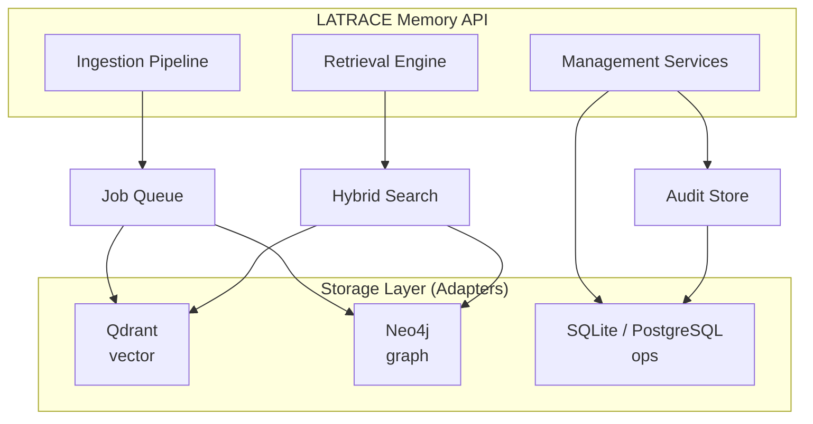

<div align="center">


# LATRACE

**Long-term Adaptive Trace for AI Context Engine**

*RAG gives the model passages. LATRACE gives the agent controllable memory operations.*

Read this in [English](README.md) | [中文](README_zh.md)

<p align="center">
  <a href="https://github.com/ZXXZ1000/LATRACE/blob/main/LICENSE"></a>
  <a href="https://www.python.org/"></a>
  <a href="https://github.com/ZXXZ1000/LATRACE/actions/workflows/ci.yml"></a>
  <a href="https://github.com/ZXXZ1000/LATRACE/releases"></a>
  <a href="https://ghcr.io/zxxz1000/latrace-memory"></a>
  <a href="https://github.com/ZXXZ1000/LATRACE/pulls"></a>
</p>

<p align="center">
  <a href="#-quick-start"><b>Quick Start</b></a> ·
  <a href="#-two-ways-to-build-with-latrace"><b>Choose a Mode</b></a> ·
  <a href="docs/api_reference.md"><b>API Reference</b></a> ·
  <a href="docs/adk_integration.md"><b>ADK Guide</b></a> ·
  <a href="https://ghcr.io/zxxz1000/latrace-memory"><b>Docker Image</b></a>
</p>

</div>

---

## 🎉 Recent Updates
- **[2026-04-01]** 🚀 LATRACE (formerly OmniMemory) is now officially open source.
- **[2026-03-20]** 🏆 Achieved **SOTA** performance on LoCoMo and LongMemEval memory benchmarks.

---

Most AI apps are amnesiac — they forget everything after each conversation. LATRACE fixes this.

LATRACE is a **production-ready memory service** for chatbots, copilots, companions, and agents that need memory you can actually control.

Instead of stuffing more text into a context window, LATRACE turns conversations into a living memory layer: tracking people, preferences, facts, relationships, states, and timelines across sessions.

**What this unlocks in products:**
- A chatbot that remembers user preferences, hobbies, and ongoing plans across sessions
- A companion agent that can follow relationship shifts, emotional state, and stress over time
- An agent system that asks explicit memory questions instead of guessing from retrieved chunks
- A multi-tenant product that keeps tenant, user, and domain data strictly isolated

---

## 🚀 Quick Start

Three commands to a running memory service:

```bash
git clone https://github.com/ZXXZ1000/LATRACE.git && cd LATRACE
cp .env.example .env
docker compose up --build
```

| Service | URL |
|---------|-----|
| Memory API | `http://localhost:8000` |
| Qdrant | `http://localhost:6333` |
| Neo4j Browser | `http://localhost:7474` |

> **Default local stack:** one API, one vector store, one graph store. No extra scaffolding needed to get started.

**Next step after booting the stack:**
- Read the [API Reference](docs/api_reference.md) for endpoint contracts and headers
- Start with `POST /ingest/dialog/v1` to write memory, then `POST /retrieval/dialog/v2` to recall it
- If you want agent-style memory tools instead of prompt injection, jump to the [ADK Guide](docs/adk_integration.md)

<details>
<summary><b>Other install options</b></summary>

**Pull the published image directly:**

```bash
docker pull ghcr.io/zxxz1000/latrace-memory:latest
docker run --rm -p 8000:8000 --env-file .env ghcr.io/zxxz1000/latrace-memory:latest
```

> Qdrant and Neo4j are not bundled — run them separately or point to existing instances.

**Local development:**

```bash
uv sync                                    # install dependencies
uv sync --extra local-embeddings --extra multimodal  # optional extras
cp .env.example .env                       # configure
uv run python -m uvicorn modules.memory.api.server:app --host 0.0.0.0 --port 8000
```

</details>

---

## 🔌 Two Ways to Build with LATRACE

Pick the integration style that matches your product. Both work against the same memory service.

<div align="center">

| **Start with Mode A** | **Start with Mode B** |
|---|---|
| You want memory in your prompt flow fast | You want your agent to query memory as tools |
| 2 HTTP calls | Python runtime or 1 agentic HTTP route |
| Best for chatbots, copilots, support apps | Best for companions, planners, agent systems |

</div>

### 📡 Mode A: Retrieval API — Memory-Enhanced RAG

> **Best for:** You already have a chat model. You just want long-term memory injected into your prompts.

*Fastest path from a stateless chatbot to a memory-enabled product.*

Your model still owns the response. LATRACE supplies the context it's missing.

**What it solves:**
- User preferences forgotten across sessions
- Repeated questions about facts you already know
- Cross-day context that silently breaks
- Timeline details that get hallucinated without evidence

**The flow is simple — ingest, recall, reply:**

```python
import httpx
import time

client = httpx.Client(
    base_url="http://localhost:8000",
    headers={"X-Tenant-ID": "my-app"},
)

# Step 1 — Write conversations into memory
ingest = client.post("/ingest/dialog/v1", json={
    "session_id": "session-42",
    "memory_domain": "dialog",
    "turns": [
        {"turn_id": "1", "role": "user", "text": "I love hiking in the mountains."},
        {"turn_id": "2", "role": "assistant", "text": "Got it — you're into mountain hiking."}
    ],
    "client_meta": {"memory_policy": "user", "user_id": "user-123"}
})
job_id = ingest.json()["job_id"]

while True:
    status = client.get(f"/ingest/jobs/{job_id}").json()["status"]
    if status == "COMPLETED":
        break
    if status.endswith("FAILED"):
        raise RuntimeError(f"ingest failed: {status}")
    time.sleep(0.5)

# Step 2 — Recall relevant memory before generating a reply
evidence = client.post("/retrieval/dialog/v2", json={
    "query": "What are this user's hobbies and recent interests?",
    "run_id": "session-42",
    "memory_domain": "dialog",
    "topk": 5,
    "client_meta": {"memory_policy": "user", "user_id": "user-123"}
}).json()

# Step 3 — Inject into your prompt
context = [item["summary"] for item in evidence.get("evidence_details", [])]
# -> feed `context` into your model's system prompt
```

> This is the fastest path to turn any chatbot, copilot, or support agent into a memory-enabled product.

---

### 🧠 Mode B: ADK Tools — Agentic Memory Brain

> **Best for:** You want the agent to **ask structured questions** about people, relationships, states, and timelines — not just retrieve fuzzy passages.

*Highest-control path when memory needs to behave like an explicit product capability, not hidden context stuffing.*

This is where LATRACE goes beyond RAG. Instead of returning top-k chunks, it exposes memory as **controllable tools**:

| Tool | What it does |
|------|-------------|
| `entity_profile` | 360-degree biography of a person or concept |
| `entity_status` | Current value of a tracked property (mood, work status, sleep quality...) |
| `status_changes` | How a property changed over time |
| `topic_timeline` | Chronological event sequence for a topic |
| `relations` | Graph relationships between entities |
| `quotes` | Exact user quotes with attribution |
| `explain` | Evidence chain behind a specific event |
| `time_since` | How long since a topic was last mentioned |

```python
from modules.memory.adk.runtime import create_memory_runtime

async with create_memory_runtime(
    base_url="http://127.0.0.1:8000",
    tenant_id="my-app",
    user_tokens=["u:user-123"],
) as memory:
    profile   = await memory.entity_profile(entity="Alice")
    status    = await memory.entity_status(entity="Alice", property="job_status")
    changes   = await memory.status_changes(entity="Alice", property="stress_level", limit=5)
    timeline  = await memory.topic_timeline(topic_path="work/project_alpha", limit=10)
    evidence  = await memory.quotes(entity="Alice", limit=3)
```

**This means your agent can ask questions like:**
- *"Has her work stress been climbing this week?"*
- *"When was the last time she mentioned Project Alpha?"*
- *"What evidence supports the claim that she's under pressure at work?"*

With plain RAG, these become "the model guesses from chunks." With ADK, they become **precise tool calls that return structured answers.**

**Two flavors in production:**
- **Bring your own agent loop** — expose tools via `memory.get_openai_tools(...)` or MCP, handle tool-calling yourself.
- **Server-routed agentic query** — call `POST /memory/agentic/query` and let LATRACE route a natural-language memory question to the right tool.

---

### 🤔 Which mode should I use?

| | **Mode A: Retrieval API** | **Mode B: ADK Tools** |
|---|---|---|
| **You want to** | Inject memory context into prompts | Let the agent query memory as tools |
| **Your app is** | Chatbot, copilot, support agent | Autonomous agent, companion, planner |
| **Memory returns** | Passages and evidence summaries | Structured profiles, states, timelines, quotes |
| **Integration effort** | 2 HTTP calls | Python runtime or 1 HTTP call |
| **You control** | What goes into the prompt | Which tools the agent can call |

---

## 🏆 Why LATRACE?

### 📊 Benchmark SOTA

We outperform existing memory solutions on **LoCoMo** and **LongMemEval** — especially in temporal reasoning, cross-session multihop tracking, and knowledge updates. See the [Benchmark Guide](docs/benchmark_guide.md) for evaluation scope and methodology.

<div align="center">

</div>

### How we compare

| Capability | **LATRACE** | Traditional RAG | Simple Agentic Memory |
|------------|---------|-----------------|----------------------|
| **Storage** | Vector + Graph + RDBMS | Vector only | JSON / text window |
| **Temporal reasoning** | Native timeline & state tracking | None | Short-term only |
| **Entity state** | Track + query property changes over time | None | None |
| **Multi-tenancy** | Strict isolation built-in | DIY | DIY |
| **Observability** | Structured logs, health, metrics | Varies | Black-box |

---

## 🏗️ Architecture



---

## 📚 Resources

| Doc | What's in it |
|-----|-------------|
| [API Reference](docs/api_reference.md) | Endpoint details, headers, payload contracts |
| [ADK Integration Guide](docs/adk_integration.md) | Tool schemas, MCP/OpenAI patterns, orchestration |
| [Tenant Isolation](docs/tenant_isolation.md) | Multi-tenant data boundaries |
| [Benchmark Guide](docs/benchmark_guide.md) | Evaluation scope and methodology |
| [Contributing](CONTRIBUTING.md) | How to submit PRs, testing expectations |

## 🔁 CI / CD

- PRs run `ruff` + `pytest` on `modules/memory`.
- Merges to `main` publish the Docker image to GHCR (`ghcr.io/zxxz1000/latrace-memory:latest`).
- Embedding connectivity tests are skipped by default. Set `REQUIRE_EMBEDDING_CONNECTIVITY=1` with provider credentials to enable.

## 🤝 Contributing

We welcome contributions, issues, and PRs. See [CONTRIBUTING.md](CONTRIBUTING.md) to get started.
Questions? [zx19970301@gmail.com](mailto:zx19970301@gmail.com)

## 📄 License

[Apache License 2.0](LICENSE)

---

<div align="center">

[Star us on GitHub](https://github.com/ZXXZ1000/LATRACE) · [API Reference](docs/api_reference.md) · [Benchmark Guide](docs/benchmark_guide.md) · [Discussions](https://github.com/ZXXZ1000/LATRACE/discussions)

</div>
