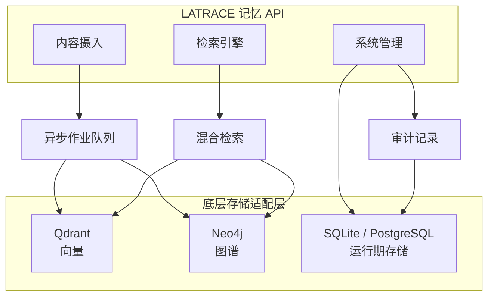

<div align="center">


# LATRACE

**Long-term Adaptive Trace for AI Context Engine**

*赋予你的 AI 梦寐以求的记忆能力。* 🌌

Read this in [English](README.md) | [中文](README_zh.md)

<p align="center">
  <a href="https://github.com/ZXXZ1000/LATRACE/blob/main/LICENSE"></a>
  <a href="https://www.python.org/"></a>
  <a href="https://github.com/ZXXZ1000/LATRACE/actions/workflows/ci.yml"></a>
  <a href="https://github.com/ZXXZ1000/LATRACE/releases"></a>
  <a href="https://ghcr.io/zxxz1000/latrace-memory"></a>
  <a href="https://github.com/ZXXZ1000/LATRACE/pulls"></a>
</p>

<p align="center">
  <a href="#quick-start"><b>快速开始</b></a> ·
  <a href="#two-ways"><b>选择接入模式</b></a> ·
  <a href="docs/api_reference.md"><b>API 文档</b></a> ·
  <a href="docs/adk_integration.md"><b>ADK 指南</b></a> ·
  <a href="https://ghcr.io/zxxz1000/latrace-memory"><b>Docker 镜像</b></a>
</p>

</div>

---

## 🎉 最新动态 (Recent Updates)
- **[2026-04-01]** 🚀 LATRACE（原 OmniMemory）核心记忆基建正式开源发布！
- **[2026-03-20]** 🏆 在 LoCoMo 与 LongMemEval 记忆基准测试中取得 **SOTA** 成绩。

---

大多数 AI 应用都患有“失忆症”：一次对话结束，就忘掉前文中的人物、偏好、关系和状态。LATRACE 正是为此而生。

LATRACE 是一个**生产级记忆服务**，面向聊天助手、Copilot、陪伴型 Agent 与各类智能体系统，提供真正可控的长期记忆能力。

它不是简单地把更多文本塞进上下文窗口，而是把对话转化为一层可查询、可追踪、可解释的活体记忆：覆盖人物、偏好、事实、关系、状态与时间线。

**它能让产品做到：**
- 让聊天助手记住用户偏好、爱好和持续中的计划
- 让陪伴型 Agent 追踪关系变化、情绪状态与压力波动
- 让 Agent 系统主动提出明确的记忆问题，而不是从检索片段里猜答案
- 让多租户产品在租户、用户、领域层面天然隔离

---

<a id="quick-start"></a>

## 🚀 快速开始

三条命令，把完整的记忆服务跑起来：

```bash
git clone https://github.com/ZXXZ1000/LATRACE.git && cd LATRACE
cp .env.example .env
docker compose up --build
```

| 服务 | 地址 |
|------|------|
| Memory API | `http://localhost:8000` |
| Qdrant | `http://localhost:6333` |
| Neo4j Browser | `http://localhost:7474` |

> **默认本地栈：** 一个 API、一个向量库、一个图数据库。开箱就能跑，不需要额外拼装基础设施。

**服务启动后，推荐你下一步这样走：**
- 先看 [API 文档](docs/api_reference.md)，了解 header、endpoint 与 payload 契约
- 先调用 `POST /ingest/dialog/v1` 写入记忆，再调用 `POST /retrieval/dialog/v2` 召回记忆
- 如果你希望走 Agent 工具模式，而不是把记忆塞回 prompt，请直接看 [ADK 指南](docs/adk_integration.md)

<details>
<summary><b>其他安装方式</b></summary>

**直接拉取已发布镜像：**

```bash
docker pull ghcr.io/zxxz1000/latrace-memory:latest
docker run --rm -p 8000:8000 --env-file .env ghcr.io/zxxz1000/latrace-memory:latest
```

> 镜像里只包含应用服务本身，不包含 Qdrant 和 Neo4j；它们需要你单独启动，或连接到现有实例。

**本地开发模式：**

```bash
uv sync
uv sync --extra local-embeddings --extra multimodal
cp .env.example .env
uv run python -m uvicorn modules.memory.api.server:app --host 0.0.0.0 --port 8000
```

</details>

---

<a id="two-ways"></a>

## 🔌 两种构建方式

按你的产品形态来选接入模式。两种方式都跑在同一套记忆服务之上。

下面的示例默认基于 `.env.example` 的本地配置，因此请求里会带上 `X-Tenant-ID`。

<div align="center">

| **先选模式 A** | **先选模式 B** |
|---|---|
| 你想尽快把长期记忆接进现有 prompt 流程 | 你想让 Agent 以工具方式查询记忆 |
| 2 个 HTTP 调用即可接入 | Python runtime 或 1 个 agentic HTTP 路由 |
| 更适合聊天助手、Copilot、客服产品 | 更适合陪伴型 Agent、规划型 Agent、智能体系统 |

</div>

### 📡 模式 A：Retrieval API / RAG 直调

> **最适合：** 你已经有自己的聊天模型，现在只想把长期记忆补进 prompt。

*这是把一个“无状态聊天产品”升级成“有长期记忆产品”的最快路径。*

最终回复仍由你的模型生成，LATRACE 负责提供它缺失的上下文。

**它解决的问题：**
- 用户偏好跨会话丢失
- 已经知道的事实还要反复问
- 跨天对话上下文悄悄断裂
- 缺少证据时，时间线细节容易被模型脑补

**流程很简单：写入、召回、再生成。**

```python
import httpx
import time

client = httpx.Client(
    base_url="http://localhost:8000",
    headers={"X-Tenant-ID": "my-app"},
)

# Step 1 - 把对话写入长期记忆
ingest = client.post("/ingest/dialog/v1", json={
    "session_id": "session-42",
    "memory_domain": "dialog",
    "turns": [
        {"turn_id": "1", "role": "user", "text": "我喜欢去山里徒步。"},
        {"turn_id": "2", "role": "assistant", "text": "记住了，你很喜欢山地徒步。"}
    ],
    "client_meta": {"memory_policy": "user", "user_id": "user-123"}
})
job_id = ingest.json()["job_id"]

while True:
    status = client.get(f"/ingest/jobs/{job_id}").json()["status"]
    if status == "COMPLETED":
        break
    if status.endswith("FAILED"):
        raise RuntimeError(f"ingest failed: {status}")
    time.sleep(0.5)

# Step 2 - 在生成回复前召回相关记忆
evidence = client.post("/retrieval/dialog/v2", json={
    "query": "这个用户最近的爱好和持续中的兴趣是什么？",
    "run_id": "session-42",
    "memory_domain": "dialog",
    "topk": 5,
    "client_meta": {"memory_policy": "user", "user_id": "user-123"}
}).json()

# Step 3 - 注入到你的 prompt 里
context = [item["summary"] for item in evidence.get("evidence_details", [])]
# -> 把 context 拼进你自己的 system prompt 或 retrieval context
```

> 这是让聊天助手、Copilot、客服系统快速拥有长期记忆能力的最短路径。

---

### 🧠 模式 B：ADK Tools / Agent 记忆大脑

> **最适合：** 你想让 Agent 结构化地询问人物、关系、状态、时间线，而不是只检索模糊片段。

*当记忆需要成为一个明确的产品能力，而不是隐藏在上下文里的“补丁”时，应该走这条路。*

这正是 LATRACE 与普通 RAG 拉开差距的地方。它不只是返回 top-k 片段，而是把记忆暴露成**可控工具**：

| 工具 | 作用 |
|------|------|
| `entity_profile` | 查询一个人或概念的 360 度档案 |
| `entity_status` | 查询某个属性的当前状态值 |
| `status_changes` | 查询某个属性随时间的变化 |
| `topic_timeline` | 查询某个主题的时间线事件序列 |
| `relations` | 查询实体之间的图谱关系 |
| `quotes` | 拉取带归因的原话引用 |
| `explain` | 查看某个结论背后的证据链 |
| `time_since` | 查询某个话题距离上次出现过去了多久 |

```python
from modules.memory.adk.runtime import create_memory_runtime

async with create_memory_runtime(
    base_url="http://127.0.0.1:8000",
    tenant_id="my-app",
    user_tokens=["u:user-123"],
) as memory:
    profile   = await memory.entity_profile(entity="Alice")
    status    = await memory.entity_status(entity="Alice", property="job_status")
    changes   = await memory.status_changes(entity="Alice", property="stress_level", limit=5)
    timeline  = await memory.topic_timeline(topic_path="work/project_alpha", limit=10)
    evidence  = await memory.quotes(entity="Alice", limit=3)
```

**这意味着你的 Agent 可以直接问出这样的问题：**
- *“她这周的工作压力是在上升吗？”*
- *“她上一次提到 Project Alpha 是什么时候？”*
- *“有哪些证据表明她最近在工作上承压？”*

在普通 RAG 里，这些问题往往会变成“模型从几段文本里猜”。在 ADK 模式里，它们会变成**明确、可控、可解释的工具调用**。

**生产里通常有两种接法：**
- **你自己掌控 agent loop**：通过 `memory.get_openai_tools(...)` 或 MCP 暴露工具，让模型按需调用。
- **交给服务端做 agentic 路由**：直接调用 `POST /memory/agentic/query`，让 LATRACE 在服务端把自然语言记忆问题路由到合适工具。

---

### 🤔 我该选哪种模式？

| | **模式 A：Retrieval API** | **模式 B：ADK Tools** |
|---|---|---|
| **你想要** | 把记忆上下文注入 prompt | 让 Agent 以工具方式查询记忆 |
| **你的产品形态** | 聊天助手、Copilot、客服系统 | 陪伴型 Agent、规划型 Agent、智能体系统 |
| **记忆返回形式** | 记忆片段与证据摘要 | 结构化档案、状态、时间线、原话 |
| **接入成本** | 2 个 HTTP 调用 | Python runtime 或 1 个 HTTP 调用 |
| **你掌控的东西** | 进 prompt 的内容 | Agent 可调用的记忆工具集合 |

---

## 🏆 为什么是 LATRACE？

### 📊 Benchmark SOTA

LATRACE 在 **LoCoMo** 与 **LongMemEval** 上展现出领先表现，尤其在时间推理、跨会话多跳追踪以及知识更新方面更有优势。评估范围与方法可以直接查看 [Benchmark 指南](docs/benchmark_guide.md)。

<div align="center">

</div>

### 如何理解它的差异

| 能力项 | **LATRACE** | 传统 RAG | 轻量 Agent 记忆 |
|--------|-------------|----------|-----------------|
| **底层结构** | 向量 + 图谱 + 关系型 | 仅向量 | JSON / 文本窗口 |
| **时间推理** | 原生支持时间线与状态追踪 | 无 | 仅短期上下文 |
| **实体状态** | 可跟踪并查询属性变化 | 无 | 无 |
| **多租户隔离** | 内建严格隔离 | 需自行实现 | 需自行实现 |
| **可观测性** | 结构化日志、健康检查、指标端点 | 各不相同 | 黑盒 |

---

## 🏗️ 系统架构



---

## 📚 相关资源

| 文档 | 你会看到什么 |
|------|--------------|
| [API 文档](docs/api_reference.md) | endpoint、header、payload 契约 |
| [ADK 指南](docs/adk_integration.md) | 工具 schema、MCP/OpenAI 接入模式、编排方式 |
| [租户隔离说明](docs/tenant_isolation.md) | 多租户边界与隔离模型 |
| [Benchmark 指南](docs/benchmark_guide.md) | 评估范围、方法与当前发布口径 |
| [贡献指南](CONTRIBUTING.md) | PR 提交流程、测试要求、协作规范 |

## 🔁 CI / CD

- Pull Request 会对 `modules/memory` 运行 `ruff` 与 `pytest`。
- 合并到 `main` 后，会自动把 Docker 镜像发布到 GHCR：`ghcr.io/zxxz1000/latrace-memory:latest`。
- embedding 连通性测试在开源默认 CI 中会跳过；如需强制执行，请配置提供商凭据并设置 `REQUIRE_EMBEDDING_CONNECTIVITY=1`。

## 🤝 参与贡献

欢迎 Issue、PR 和各种形式的共建。开始前请先阅读 [CONTRIBUTING.md](CONTRIBUTING.md)。

准备好的 PR 会进入维护流程进行审查与合并。
如果你在使用或接入过程中遇到问题，请联系邮箱：[zx19970301@gmail.com](mailto:zx19970301@gmail.com)

## 📄 License

[Apache License 2.0](LICENSE)

---

<div align="center">

[Star 我们的项目](https://github.com/ZXXZ1000/LATRACE) · [API 文档](docs/api_reference.md) · [Benchmark 指南](docs/benchmark_guide.md) · [Discussions](https://github.com/ZXXZ1000/LATRACE/discussions)

</div>
