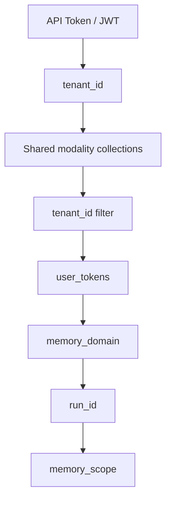
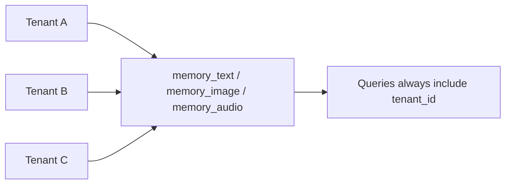
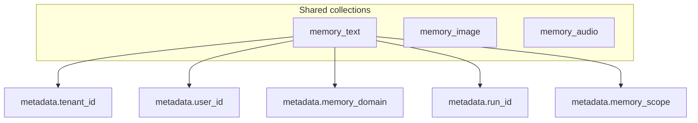
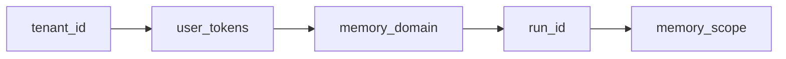
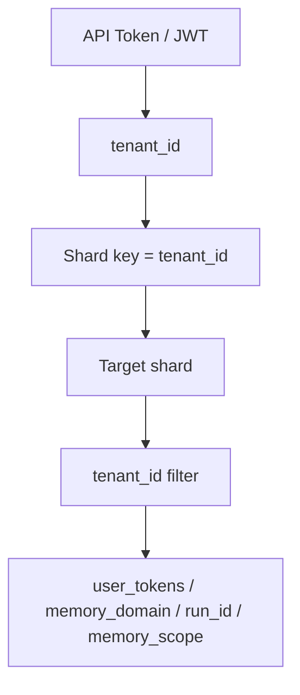
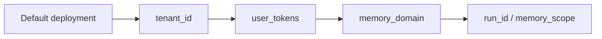
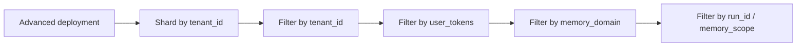

# LATRACE Tenant Isolation Strategy

This guide explains the tenant isolation strategy used by LATRACE across tenants, users, apps, and sessions.

It is written for self-hosted developers who call Memory directly and need to understand:

- what the current isolation boundary is
- which fields are required to avoid cross-contamination
- how to think about multi-tenant deployments at higher scale

---

## Overview

LATRACE uses a layered isolation strategy.

Not every field has the same meaning:

- some fields define a hard storage boundary
- some fields define a namespace inside that boundary
- some fields only narrow a search or a session

The current default setup is:



In plain terms:

- authentication resolves the caller into a `tenant_id`
- data is written into shared collections per modality
- queries are isolated by `tenant_id`
- `user_tokens`, `memory_domain`, `run_id`, and `memory_scope` further narrow access and retrieval

---

## Isolation Layers

### 1. `tenant_id`: the hard isolation boundary

`tenant_id` is the primary isolation key in LATRACE.

Use it to separate:

- customers
- environments
- organizations
- fully independent applications

This is the boundary that prevents one tenant from reading another tenant's memory.

If you operate a multi-tenant deployment, `tenant_id` should be treated as mandatory.



### 2. `user_tokens`: the principal boundary inside a tenant

`user_tokens` are the strongest isolation key inside a single tenant.

Use them to separate:

- end users
- accounts
- personas
- application-owned principals

Examples:

- `["u:alice"]`
- `["u:bob"]`
- `["u:alice", "agent:planner"]`

If two requests share the same `tenant_id` but use different `user_tokens`, retrieval and graph expansion can stay separated inside the tenant.

### 3. `memory_domain`: the namespace inside a user or app context

`memory_domain` is an application namespace such as:

- `dialog`
- `work`
- `support`
- `planning`

Use it when the same user or tenant should keep different memory surfaces separate.

This is the recommended way to prevent cross-recall between different product surfaces inside the same tenant.

### 4. `run_id`: the session or task boundary

`run_id` groups memory by session, conversation, or task execution.

Use it for:

- session-local retrieval
- session-local deduplication
- conversation replay and debugging

It is not a tenant boundary. It is a local scope boundary.

### 5. `memory_scope`: the narrowest local scope

`memory_scope` is for highly localized isolation, for example:

- a single video
- a single imported asset
- a single ephemeral workspace

It is useful when you need a boundary narrower than `run_id`.

---

## What API Keys Do

API keys authenticate the caller. They do not define the primary memory partition by themselves.

In the current public interface:

- API key or JWT identifies the caller
- the request resolves to a `tenant_id`
- `tenant_id` becomes the storage isolation boundary

If you need strict separation between multiple apps under one tenant, do not rely on API key identity alone. Use:

- distinct `memory_domain` values
- distinct `user_tokens`
- or separate `tenant_id` values when you need a hard boundary

---

## Current Storage Layout

LATRACE currently uses shared collections per modality, not per tenant.

That means:

- text memories go into a text collection
- image memories go into an image collection
- audio memories go into an audio collection

Tenants are separated logically inside those collections.



This layout is correct for:

- self-hosted single-tenant deployments
- small and medium multi-tenant deployments
- most direct Memory API use cases

---

## Recommended Key Hierarchy

For most developers, the isolation hierarchy should be understood like this:



You can read this as:

1. `tenant_id` decides who owns the memory space
2. `user_tokens` decide which principals inside that tenant may see it
3. `memory_domain` decides which product namespace it belongs to
4. `run_id` decides which session or task it belongs to
5. `memory_scope` decides the narrowest local boundary

---

## How To Choose The Right Key

| Need | Recommended field |
| --- | --- |
| Separate two customers | `tenant_id` |
| Separate two users inside one customer | `user_tokens` |
| Separate chat memory from planning memory | `memory_domain` |
| Restrict to one conversation or task | `run_id` |
| Restrict to one asset or local subspace | `memory_scope` |

Examples:

### Customer boundary

```json
{
  "tenant_id": "acme-prod",
  "user_tokens": ["u:alice"],
  "memory_domain": "dialog"
}
```

### Same tenant, different product surfaces

```json
{
  "tenant_id": "acme-prod",
  "user_tokens": ["u:alice"],
  "memory_domain": "support"
}
```

```json
{
  "tenant_id": "acme-prod",
  "user_tokens": ["u:alice"],
  "memory_domain": "planning"
}
```

### Session-local retrieval

```json
{
  "tenant_id": "acme-prod",
  "user_tokens": ["u:alice"],
  "memory_domain": "dialog",
  "run_id": "sess_2026_04_01_001"
}
```

---

## Recommended Developer Rules

### Rule 1: always send a stable `tenant_id`

If you are self-hosted but only have one tenant, still use a stable value such as:

- `local-dev`
- `prod-main`
- `my-app`

This keeps data ownership explicit and makes future migration easier.

### Rule 2: do not treat API keys as your namespace boundary

API keys are credentials. They are not your primary namespace contract.

If you need multiple isolated application surfaces, represent them explicitly with:

- `tenant_id`
- `user_tokens`
- `memory_domain`

### Rule 3: always send `user_tokens` for end-user applications

If your application serves multiple end users, do not rely on tenant-level isolation alone.

Always provide stable user tokens such as:

- `u:user_123`
- `u:customer_abc`

### Rule 4: use `memory_domain` for product boundaries

If the same user has different memory surfaces, isolate them by domain:

- `dialog`
- `notes`
- `crm`
- `agent`

### Rule 5: use `run_id` for session-local reads and writes

If you want conversation- or task-local behavior, use `run_id`.

This is especially useful for:

- dialog retrieval
- temporary task context
- evaluation runs

---

## Advanced Deployment: Tenant Sharding

The current default setup uses shared collections with logical tenant isolation.

At larger scale, a multi-tenant operator may want to reduce resource interference between tenants.

That is where shard-level isolation becomes useful.

### What shard-level isolation changes

It does not replace `tenant_id`.

Instead, it changes where the tenant boundary is enforced physically:



### Recommended shard key

If you deploy advanced multi-tenant sharding, the recommended shard key is:

- `tenant_id`

Not:

- `user_tokens`
- `run_id`
- `memory_scope`

Why:

- `tenant_id` is stable
- it matches the hard ownership boundary
- it reduces cross-tenant resource contention
- it does not fragment memory into tiny physical partitions

### What remains inside the shard

Even with tenant sharding enabled, these should remain logical filters inside the tenant shard:

- `user_tokens`
- `memory_domain`
- `run_id`
- `memory_scope`

This gives you the right split:

- physical isolation at the tenant layer
- logical isolation inside the tenant

---

## Current Recommendation

For most public users of LATRACE:



For advanced operators with heavy multi-tenant traffic:



In short:

- use `tenant_id` as the hard ownership boundary
- use `user_tokens` as the principal boundary
- use `memory_domain` as the namespace boundary
- use `run_id` and `memory_scope` as local scope boundaries
- shard by `tenant_id` when you need stronger physical isolation at scale

---

## Summary

LATRACE isolates memory in layers.

The most important rule is:

> `tenant_id` owns the memory space. Everything else narrows scope inside that space.

That means:

- `tenant_id` is the hard boundary
- `user_tokens` separate principals inside a tenant
- `memory_domain` separates product namespaces
- `run_id` and `memory_scope` narrow local context

This strategy keeps the public API simple while still supporting more advanced multi-tenant deployments later.
